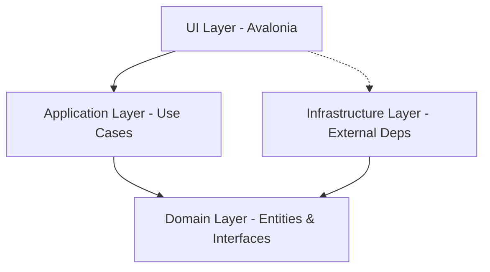

# WeatherApp — Avalonia Desktop (Linux) — Weather client

Lightweight, multiplatform desktop client built with Avalonia UI and organized using **Clean Architecture + MVVM**.

## Objective
- Multi-platform desktop application (optimized for Linux) that consumes the OpenWeatherMap API.
- Demonstrates engineering best practices: Dependency Injection, Resilience Patterns, and Automated Testing.

## Features
- 🌦️ **Real-time Weather**: Get current temperature, description, humidity, and wind speed.
- 🖼️ **Visual Icons**: Dynamic weather icons fetched directly from the API.
- 🌓 **Dark Mode**: Toggle between Light and Dark themes with a single click.
- ⚡ **Optimized UX**: Auto-focus on input, support for the **Enter** key, and loading indicators.
- 🛡️ **Resilience**: Integrated retry policies with exponential backoff and timeout handling using **Polly**.
- 🧪 **Fully Tested**: Unit and Infrastructure tests using xUnit, Moq, and MockHttp.

## System Architecture

### Layers & Responsibilities



#### Detailed Diagram
```
┌─────────────────────────────────────────────┐
│          UI Layer (Avalonia)                │
│  ┌──────────────────────────────────────┐   │
│  │ Views (MainWindow.axaml)              │   │
│  │ - Dynamic Layout (Grid/Cards)        │   │
│  │ - Data bindings & Converters         │   │
│  │ - Dark/Light Theme Switching         │   │
│  └──────────────────────────────────────┘   │
│  ┌──────────────────────────────────────┐   │
│  │ ViewModels (MainWindowViewModel)     │   │
│  │ - Commands: GetWeather, ToggleTheme  │   │
│  │ - Properties: Humidity, Wind, Icon   │   │
│  └──────────────────────────────────────┘   │
└─────────────────────────────────────────────┘
           ↓ (Dependency Injection)
┌─────────────────────────────────────────────┐
│      Application Layer (Use Cases)          │
│  ┌──────────────────────────────────────┐   │
│  │ GetWeatherUseCase                    │   │
│  │ - Orchestrates logic & error mapping │   │
│  │ - Returns GetWeatherResponse        │   │
│  └──────────────────────────────────────┘   │
└─────────────────────────────────────────────┘
           ↓ (Interface: IWeatherService)
┌─────────────────────────────────────────────┐
│      Domain Layer (Core Rules)              │
│  ┌──────────────────────────────────────┐   │
│  │ Entities:                            │   │
│  │ - Weather (City, Temp, Wind, Icon)   │   │
│  └──────────────────────────────────────┘   │
│  ┌──────────────────────────────────────┐   │
│  │ Interfaces:                          │   │
│  │ - IWeatherService (Contract)         │   │
│  └──────────────────────────────────────┘   │
└─────────────────────────────────────────────┘
           ↑ (Implementation)
┌─────────────────────────────────────────────┐
│    Infrastructure Layer (External Deps)    │
│  ┌──────────────────────────────────────┐   │
│  │ OpenWeatherMapService                │   │
│  │ - HttpClient (Polly: Retries/500s)   │   │
│  │ - 404 Optimized Handling             │   │
│  └──────────────────────────────────────┘   │
│  ┌──────────────────────────────────────┐   │
│  │ DTOs & Mappers                       │   │
│  │ - OpenWeatherMapWeatherDto           │   │
│  └──────────────────────────────────────┘   │
└─────────────────────────────────────────────┘
```

### Project Structure

```
WeatherApp.sln
├── WeatherApp.UI (Avalonia Desktop)
│   ├── ViewModels/          # Presentation logic
│   ├── Converters/          # Image & InverseBool converters
│   ├── App.axaml            # Global styles & themes
│   └── MainWindow.axaml     # Main view layout
│
├── WeatherApp.Application (Use Cases)
│   └── UseCases/GetWeather/ # Business workflows
│
├── WeatherApp.Domain (Core)
│   ├── Entities/            # Pure POCO entities
│   └── Interfaces/          # Service contracts
│
├── WeatherApp.Infrastructure (External)
│   ├── Services/            # HTTP Clients & Stubs
│   └── DependencyInjection/ # DI Registration logic
│
└── WeatherApp.Tests (Testing)
    ├── GetWeatherUseCaseTests.cs
    ├── OpenWeatherMapServiceTests.cs  # Infra mocking
    └── MainWindowViewModelTests.cs    # UI logic tests
```

## Resilience & Error Handling
The application uses **Polly** to handle network instability:
- **Exponential Backoff:** Retries up to 3 times with increasing delays.
- **Server Error Handling:** Automatically retries on 500+ status codes.
- **Optimized 404s:** Specifically detects "City Not Found" and returns a clean result without unnecessary retries.
- **Timeouts:** 15-second global timeout for API requests.

## Setup & Execution

### Prerequisites
- .NET 8 SDK
- A graphical session (X11/Wayland) for Linux.

### Run with Real API (OpenWeatherMap)
1. Get a free API key at [openweathermap.org](https://openweathermap.org/api).
2. Use the provided helper script:
```bash
chmod +x run-with-api.sh
./run-with-api.sh YOUR_API_KEY_HERE
```

### Run with Mock Data (Stub)
If no API key is provided, the app uses `WeatherServiceStub` with sample data for `London`, `Madrid`, and `Sydney`.
```bash
dotnet run --project WeatherApp.UI
```

## Testing
The project maintains a high test coverage for core and infrastructure logic.
```bash
dotnet test
```

## Contributing / Next Steps
1. ✅ **Implemented**: Dark Mode, Extended Weather Data, UI Polish.
2. 🚀 **Next**: Linux Packaging (AppImage/Flatpak).
3. 📍 **Planned**: Multi-city comparison and 5-day forecast.

---
Built with ❤️ using .NET 8 and Avalonia UI.
